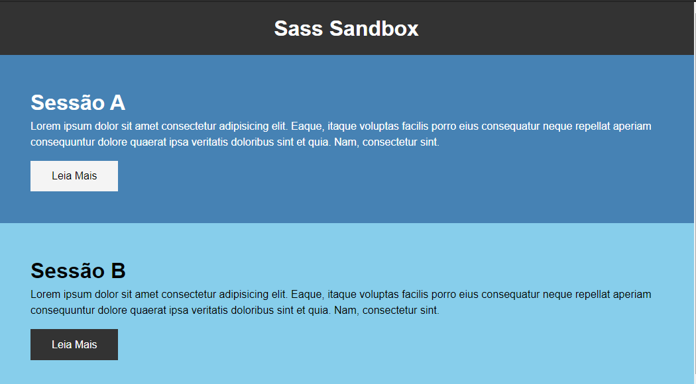

<h1 align="center">
  SASS Sandbox
</h1>

## 📋 Índice

- [Preview](#-Preview)
- [Sobre](#-Sobre)
- [Tecnologias utilizadas](#-Tecnologias-utilizadas)
- [Como executar o projeto](#-Como-executar-o-projeto)

---

## 🖥 Preview

  

---

## 📖 Sobre 

Este site foi feito durante o curso 'Modern HTML & CSS From The Beginnig' do professor Brad Traversy como exercício de introdução ao SASS. Para esse exercício simples utilizamos os conceitos de variáveis, Funções e Mixins da tecnologia SASS.

---

## 🚀 Tecnologias utilizadas
O projeto está sendo desenvolvido com as seguintes tecnologias:
- HTML5
- CSS3
- SASS

---

## ⌨ Como executar o projeto

Baixe o arquivo .ZIP do projeto e após descompactar abra o arquivo index.html

---

